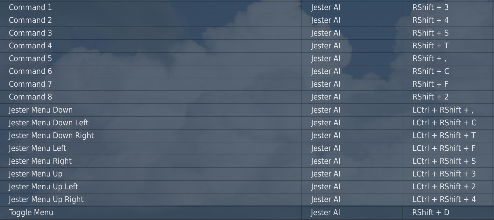
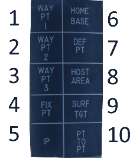
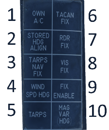

This is a guide to make Jester less of a pain by cross-binding stuff from the RIO cockpit.

# Introduction

This is a set of modifications and utilities that lets you avoid common problems with Jester in the F-14.
Works in multiplayer. From the pilot seat you can:

* Manually control radar azimuth and elevation
* Change TWS shooting priority
* Hook TID targets for extended information
* Lock up contacts from TID
* Change TID display settings to reduce clutter
* Initiate flare and chaff programs
* Assign Jester actions to single keypress
* Perform navigation fixes for when Jester screws up nav
* Control RWR display with limit and offset functions
* Control LANTIRN with buttons instead of head tracking
* Control radar main lobe clutter filter

# Prerequisites

* vJoy - https://github.com/shauleiz/vJoy
* Autohotkey - https://www.autohotkey.com/
* DCS Input Command Injector - https://github.com/Quaggles/dcs-input-command-injector 

# Installation

1. Copy `InputCommands` to DCS Saved Games folder. DCS will need to be restarted
1. _(Optionally)_ Copy `Kneeboard` to DCS Saved Games folder if you will do NAV FIXES or will use CAP from the front seat

# Configuration

### 1. Getting your joystick ID

1. Run `utils/joyids.ahk`. A tooltip should appear at the cursor.
1. Hold __Button 1__ on the joystick you want to use for radar control.
1. Write down number of the joystick displayed, you will need it later for the configuration.

### 2. Utility configuration

Open `bearingjester.ahk` and configure keybinds there. 

1. On line `#9` you need to specify you joystick ID that you got from your previous step
1. On line `#21` you want to change the buttons on the joystick to control the radar:

```ahk
    SummedAxis(MOD, DOWN, UP, RESET, 0.08, "ry")
    SummedAxis(MOD, LEFT, RIGHT, RESET, 0.6, "rx")
```

* `DOWN`, `UP`, `LEFT`, `RIGHT` are the button numbers on the set joystick to control radar. Its the same button number DCS displays in Controls.
* `MOD` can be a joystick button that you need to hold to enable radar controls, leave at `0` to disable and just use buttons as is.

3. On line `#39` edit the mod key to activate Jester macroses with (if needed)

### 3. DCS keybinds configuration

#### Jester AI

For Jester macro to work you have to bind the Jester menu binds to specific keys:


If you already use any of those bindings you can change keys that utility uses by editing _JESTER Menu mapping_ section in the `bearingjester.ahk`.

#### Axis

Bind two axis - `Radar elevation control` to `vJoy RY` and `Radar azimuth control` to `vJoy RX`.

Verify that axis control and Jester macroses actually work. Then you can set `DEBUG` to `false` on line `#8` of the script to remove debugging messages and artificial slowdowns.

# Features

While most features are very simple to use, you might want to practice some first from the RIO pit to get the idea how TID hooking works, which buttons do what and when, since you will be doing it practically blind from the front seat.

* __Radar control__ - use the joystick buttons you've set up during configuration. Keep in mind that TWS auto will override your control as soon as it picks up any contacts, but you can ask Jester to switch to TWS manual and that will let you control the radar
* __TID Hooks__ - you need to bind `HCU half-action` (this needs to be held down to bring up the cursor), `HCU backward/forward/left/right` to move it and `HCU full-action` to hook stuff. Note that pressind the `half-action` will unhook whatever is hooked and that can screw up Jester doing stuff. For example, if you unhook waypoint that he's entering lat\lon for it will screw up the navigation suite and __you__ will need to perform an in flight nav fix to get it working again
* __TID Symbology Settings__ - bind any of the `TID Symbology: ...` binds to toggle specific elements on-off. Most useful ones are `Alt Num`, `Vec Vector`, `Sym Elem` and `Data Link`
* __STT hooked contact__ - bind `RADAR Pulse (Doppler) Single Target Track`, it will attemp to STT the contact that you've hooked on TID
* __TID Range and Ground Stab__ - if you ask Jester for a specific range he will stop changind it himself, then you can use bind `TID range: X` to change ranged instantaneously. Aircraft\Ground stabilization cannot be changed directly and you have to do it via `Jester AI` bindings with delays
* __TWS Shooting Priority__ can be changed by hooking a contact and using bind `Next launch`. The contact will become new 1st TWS contact
* __Chaff and Flare programs__ - bind `AN/ALE-39 Right Data Dispenser Switch Down - Chaff Program` and `AN/ALE-39 Right Data Dispenser Switch Right - Flare Program`
* __RWR Offset and Limit functions__ - bind `RWR Display Mode LMT` and `RWR Display Mode OFST`
* __Control LANTIRN via keys__ - disable Jester and then use binds `LANTIRN Slew Up/Down/Left/Right`. You can also use direct head control which will stop him from messing with the Lantirn, but the moment that is disable he will snap the TGP back to his own last position
* __Disable/enable MLC__ - use binds `MLC out` and `MLC auto` to turn MLC off or get it back to auto position. Don't leave it in out, Jester won't fix it for you

### Jester Macros
There are a couple of predefined macroses in `bearingjester.ahk` starting at line `#40`:
* `RShift+,` - SIL the radar
* `RShift+.` - OPER the radar
* `RShift+/` - Enable TWS MAN

You can add your own after `MACROS := []` line, with the following syntax:
```ahk
MACROS["KEY_TO_TRIGGER"] := "SEQUENCE"
```
Where `KEY_TO_TRIGGER` would be the key you need to press in order to activate it (don't forget that you also need to hold `MACROS_MOD` which is `RShift` by default), and `SEQUENCE` corresponds to the sequence of items to select starting from the main Jester menu (which is always brought up when you press `Jester AI - Toggle Menu` twice), as they numbered in the menu itself. Keep in mind that some items change positions based on circumstances.

### (Not needed anymore) Navigation fixes 
You can perform navigation fixes, albeit doing it blindly is tricky. For that you will need `CAP button X` mapped, and also `CAP category NAV` plus `CAP category TAC`.
You can read up on the full procedure in the [Heatblur manual](https://www.heatblur.se/F-14Manual/general.html#navigation-fix-update), and I strongly recommend doing it a couple of times from the RIO seat in single player before attempting it blind.
##### TACAN Front Seat Fix
Even if you do everything correctly nav will still be off by a couple of NMs. Multiple attempts may be needed to get the accuracy right.
1. Tune in to a TACAN station with known position. You can do it with moving station, with varying results in the accuracy based on your timing
1. Ask Jester to setup a waypoint (any will do) for you on that TACAN station position. You can use map marker for that
1. Hit `CAP category TAC`:


1. Press corresponding `CAP button` to hook that waypoint. Note that you can also do that by simply hooking it up on the TID if it happen to be visible
1. Hit `CAP category NAV`:


1. Press `CAP button 6` to start the fix. Delta will be recalculated every couple of seconds, and you also can force it by pressing the button
1. Press `CAP button 9` to apply the delta

##### Visual Front Seat Fix
1. Ask Jester to setup a waypoint (any will do) that you plan to overfly. You can use map marker for that
1. Hit `CAP category NAV`:


1. When you are directly over the waypoint press `CAP button 8` to start the fix
1. Press `CAP button 9` to apply the delta

## Limitations
I've went over most of the useful features and excluded ones that Jester won't let you do. This include things like instantaneous aircraft/ground stab (Jester will immediately switch it back), changing elevation bars or azimuth scan range (same story), changing LANTIRN zoom (in every mode I've tried Jester will switch it back either immediately or after a short amount of time).

You can disable Jester altogether and then control pretty much everything from the front cockpit, but then you can't IFF (techically speaking you can IFF but you will never see the result since it's displayed on the DDD), which is a dealbreaker obviously. So features denied by the Jester are controlled via one-key Jester menu macroses.
